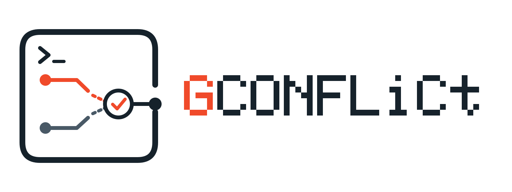

# gconflict

gconflict es una interfaz de terminal para resolver conflictos de Git.
Permite inspeccionar conflictos de tipo `CONTENT`, editar su contenido y
guardar la resolución desde una interfaz Textual. Los tipos de conflicto que
no son compatibles se muestran como no soportados.

## Prerrequisitos

- Python 3.13 o superior
- Git disponible en el sistema

## Instalación

Desde una copia local del repositorio:

```bash
python -m pip install .
```

Para desarrollo, usa una instalación editable con las dependencias opcionales:

```bash
python -m pip install -e ".[dev]"
```

## Ejecución

```bash
gconflict [directory]
```

`directory` es opcional y permite indicar el directorio del repositorio. Usa
`--help` para consultar las opciones disponibles y `--version` para mostrar la
versión instalada.

## Uso

- `↑`/`↓`: seleccionar un conflicto.
- `e`: abrir el conflicto seleccionado en un editor externo.
- `s`: guardar el contenido editado.
- `m`: marcar el conflicto como resuelto.
- `q`: salir.

Guardar (`s`) y marcar como resuelto (`m`) son acciones explícitas e
independientes. Para el editor externo se da prioridad a `VISUAL` y, si no
está definida, a `EDITOR`.

La aplicación emite estos códigos de salida:

- `0`: ejecución completada o salida normal.
- `2`: uso incorrecto o error al procesar los argumentos.
- `4`: error al acceder o procesar el repositorio.

## Alcance

Actualmente solo se pueden resolver conflictos `CONTENT`; otros tipos se
identifican como no soportados. El proyecto se instala desde el checkout y
ofrece instalación editable para desarrollo. No se afirma que exista una
publicación en PyPI ni que el paquete esté disponible allí.
